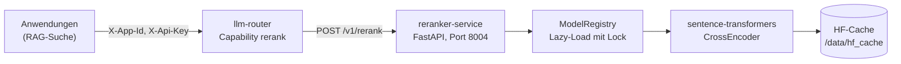

# reranker-service

[](https://github.com/janpow77/reranker-service/actions/workflows/image.yml)

[](LICENSE)

**Cross-Encoder-Reranker als kleiner HTTP-Dienst: Er bekommt eine Anfrage und eine Liste von Textpassagen
und gibt sie nach Relevanz sortiert zurück. Gedacht als Rerank-Stufe hinter einer Vektorsuche (RAG),
angesprochen über einen vorgeschalteten LLM-Router.**

## Auf einen Blick

- **Rerank-API** unter `POST /v1/rerank` (Alias `POST /rerank`), Schema angelehnt an Cohere/Voyage-Rerank, mit `top_k` und optional zurückgegebenen Texten.
- **Mehrsprachig ab Werk:** Standardmodell `BAAI/bge-reranker-v2-m3`, auch für deutsche Texte geeignet; weitere Cross-Encoder werden beim ersten Aufruf nachgeladen.
- **Sofort startklar:** Das Docker-Abbild bringt das Standardmodell bereits mit, der erste Start braucht keinen Download von Hugging Face.
- **CPU oder GPU:** `RERANKER_DEVICE=cpu|cuda`, GPU-Override per `compose.gpu.yaml`.
- **Schutzgrenzen:** optionaler `X-Api-Key`, Höchstzahl an Passagen je Anfrage, Kürzung überlanger Passagen.

## Architektur



Anwendungen sprechen den Dienst nicht direkt an, sondern über den llm-router, der Anfragen mit der
Capability `rerank` an einen passenden reranker-service weiterleitet.

## Schnellstart

Voraussetzung: Docker mit Compose-Plugin.

```bash
sudo mkdir -p /var/lib/reranker/data
sudo chown 1000:1000 /var/lib/reranker/data
docker compose up -d          # Abbild ghcr.io/janpow77/reranker-service:latest, CPU
```

Beispiel gegen einen laufenden Dienst (tatsächliche Ausgabe, GPU-Betrieb):

```console
$ curl -s http://localhost:8004/health
{"status":"ok","version":"0.1.0","device":"cuda","default_model":"BAAI/bge-reranker-v2-m3","models_loaded":["BAAI/bge-reranker-v2-m3"],"models_configured":["BAAI/bge-reranker-v2-m3"]}

$ curl -s -X POST http://localhost:8004/v1/rerank \
    -H 'Content-Type: application/json' \
    -d '{"query":"Wie hoch ist der Fördersatz?",
         "passages":["Der Fördersatz beträgt 50 Prozent der förderfähigen Ausgaben.",
                     "Das Vorhaben beginnt im März.",
                     "Die Zuwendung wird als Zuschuss gewährt."],
         "top_k":2}'
{"model":"BAAI/bge-reranker-v2-m3","duration_ms":33,"scores":[0.9645194411277771,0.000016428984963567927,0.002021838678047061],"ranking":[{"index":0,"score":0.9645194411277771,"document":null},{"index":2,"score":0.002021838678047061,"document":null}]}
```

`scores` folgt der Reihenfolge der Eingabe, `ranking` ist absteigend sortiert und auf `top_k` gekürzt;
`index` verweist auf die ursprüngliche Position.

Ohne Docker, für die Entwicklung:

```bash
pip install -e ".[dev]"
uvicorn reranker_service.main:app --host 0.0.0.0 --port 8004
pytest            # mockt sentence-transformers, kein Modell-Download
ruff check .
```

<details>
<summary><b>API</b></summary>

| Methode | Pfad | Zweck |
|---------|------|-------|
| GET | `/health` | Liveness inkl. geladener und konfigurierter Modelle |
| GET | `/v1/models` | Modell-Liste im OpenAI-Stil (Capability `rerank`) |
| POST | `/v1/rerank` | Rerank (vom llm-router weitergeleitet) |
| POST | `/rerank` | Alias ohne `/v1`-Präfix, gleicher Payload |
| GET | `/` | Dienstinfo mit Endpunktliste |

Anfrage:

```json
{
  "model": "BAAI/bge-reranker-v2-m3",
  "query": "EFRE Förderbescheid Auflagen",
  "passages": [
    "Auflage 1: Beleg jeder Ausgabe …",
    "Allgemeine Verpflichtung zur Kommunikation …",
    "Kontoauszug aus dem Vorhaben-Konto …"
  ],
  "top_k": 5,
  "return_documents": false
}
```

- `model` ist optional (sonst `RERANKER_DEFAULT_MODEL`), `query` und `passages` sind Pflicht und dürfen nicht leer sein.
- Mit `return_documents: true` steht der Passagentext in `ranking[].document`.
- Mehr als `RERANKER_MAX_PASSAGES` Passagen ergeben `413`, ein nicht gefundenes Modell `404`, leere Felder `422`, ein falscher oder fehlender Schlüssel bei gesetztem `RERANKER_API_KEY` `401`.

Antwort:

```json
{
  "model": "BAAI/bge-reranker-v2-m3",
  "duration_ms": 38,
  "scores": [0.92, 0.41, 0.78],
  "ranking": [
    {"index": 0, "score": 0.92, "document": null},
    {"index": 2, "score": 0.78, "document": null},
    {"index": 1, "score": 0.41, "document": null}
  ]
}
```

</details>

<details>
<summary><b>Modelle</b></summary>

Standard-Preload ist `BAAI/bge-reranker-v2-m3` (568 MB, mehrsprachig). Mehrere Modelle kommagetrennt:

```bash
RERANKER_PRELOAD_MODELS=BAAI/bge-reranker-v2-m3,cross-encoder/ms-marco-MiniLM-L-6-v2
```

Bisherige Zuordnung: `bge-reranker-v2-m3` für audit_designer und workshop (Memory-Modul),
`cross-encoder/ms-marco-MiniLM-L-6-v2` für flowinvoice (englischer MS-MARCO-Standard).
Nicht vorgeladene Modelle werden beim ersten Request geladen und anschließend in `/v1/models` gelistet.

</details>

<details>
<summary><b>Konfiguration (Umgebungsvariablen)</b></summary>

| Variable | Standard | Zweck |
|----------|----------|-------|
| `RERANKER_PORT` | `8004` | Port von uvicorn |
| `RERANKER_HOST` | `0.0.0.0` | Wird beim Start nur protokolliert; das Container-Entrypoint bindet fest an `0.0.0.0` |
| `RERANKER_DEVICE` | `cpu` | `cpu` / `cuda` / `cuda:0` |
| `RERANKER_DEFAULT_MODEL` | `BAAI/bge-reranker-v2-m3` | Modell, wenn der Request kein `model` setzt |
| `RERANKER_PRELOAD_MODELS` | `BAAI/bge-reranker-v2-m3` | Kommagetrennt, beim Start laden |
| `RERANKER_EAGER_LOAD` | `true` | Modelle beim Start laden statt beim ersten Request |
| `RERANKER_API_KEY` | leer | Gesetzt: Header `X-Api-Key` wird verlangt |
| `RERANKER_MAX_PASSAGES` | `200` | Höchstzahl Passagen je Request |
| `RERANKER_MAX_PASSAGE_CHARS` | `8000` | Längere Passagen werden vor dem Tokenizer gekürzt |
| `RERANKER_MAX_SEQ_LEN` | `512` | Token-Kürzung im Cross-Encoder |
| `HF_HOME` | `/data/hf_cache` | Hugging-Face-Cache |

Nur für Compose (siehe [.env.example](.env.example)):

| Variable | Standard | Zweck |
|----------|----------|-------|
| `IMAGE_TAG` | `latest` | Tag des GHCR-Abbilds |
| `RERANKER_BIND` | `0.0.0.0` | Host-Adresse des Port-Mappings, z. B. auf eine interne Schnittstelle begrenzen |

Mit Env-Datei starten:

```bash
docker compose --env-file /etc/reranker-service/env up -d
```

</details>

<details>
<summary><b>Bau und Betrieb</b></summary>

**Abbild bauen.** Die CI ([image.yml](.github/workflows/image.yml)) baut bei Push auf `master`/`main`,
bei Tags `v*.*.*` und manuell und schiebt nach `ghcr.io/janpow77/reranker-service`
(Tags u. a. `latest`, `sha-…`, Semver). Lokal:

```bash
# CPU (Standard, etwa 3 GB inkl. vorgeladenem Modell)
docker build -t ghcr.io/janpow77/reranker-service:v0.1 .
docker push ghcr.io/janpow77/reranker-service:v0.1
```

Das Modell wird im Build nach `/opt/hf_cache_baked` geladen (Build-Argument `PRELOAD_MODEL`) und beim
ersten Start in das leere `/data/hf_cache` kopiert. Der Bind-Mount `/var/lib/reranker/data` hält den Cache dauerhaft.

**GPU.** Voraussetzung ist das nvidia-container-toolkit:

```bash
docker compose -f compose.yaml -f compose.gpu.yaml up -d
```

Das GHCR-Abbild `:latest` enthält CPU-Torch. Für eine GPU-Variante wird lokal mit CUDA-Torch gebaut;
Blackwell-Karten (RTX 50xx, sm_120) brauchen torch ≥ 2.7 mit CUDA 12.8:

```bash
docker build \
  --build-arg TORCH_INDEX_URL=https://download.pytorch.org/whl/cu128 \
  --build-arg TORCH_SPEC=torch==2.7.1 \
  -t reranker-service:gpu .
```

Gemessen am 16.09.2026: CPU-Torch brauchte bei Last 14 auf 20 Kernen **4,4–4,7 s für zwei kurze Passagen**,
zu langsam für eine Memory-Suche mit 1-s-Budget. Auf einer RTX 5060 (8 GB) sind es **40 ms für acht Passagen**.

**Einbindung in den llm-router.** Nach dem Deploy einen Spoke anlegen (Konfiguration oder Admin-Oberfläche):

```yaml
spokes:
  - name: reranker
    base_url: http://<reranker-host>:8004
    type: openai             # /v1/rerank-kompatibel
    capabilities: [rerank]
    enabled: true
    priority: 10

routes:
  - model_glob: "*reranker*"
    spoke_id: <id-des-spokes>
  - model_glob: "cross-encoder/*"
    spoke_id: <id-des-spokes>
```

Anwendungen rufen danach `/v1/rerank` am llm-router mit ihren üblichen Headern (`X-App-Id`, `X-Api-Key`) auf.

</details>

## Dokumentation

- [ARCHITEKTUR.md](ARCHITEKTUR.md): Modulkarte, aus dem Code-Graphen erzeugt
- [CLAUDE.md](CLAUDE.md): Arbeitskontext für Coding-Agenten
- [.env.example](.env.example): Vorlage für die Compose-Umgebung

## Mitwirkung

Issues und Pull Requests sind willkommen. Vor einem PR `pytest` und `ruff check .` ausführen.

## Lizenz

Veröffentlicht unter der [MIT-Lizenz](LICENSE), Copyright (c) 2026 Jan Riener.
